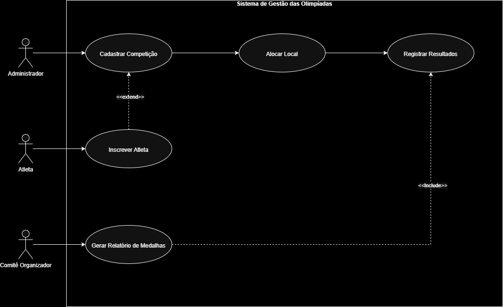
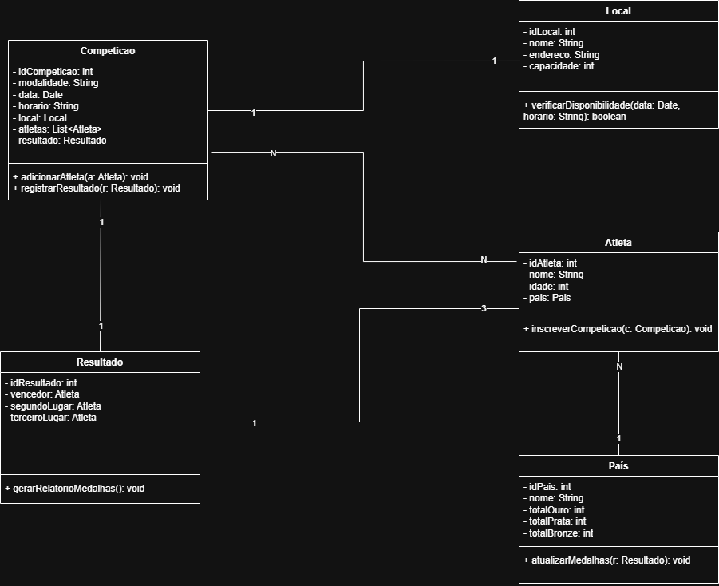
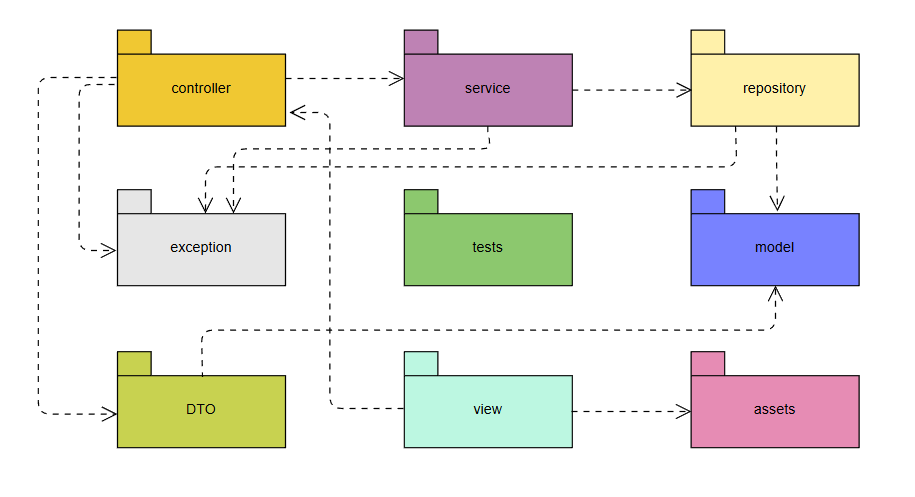
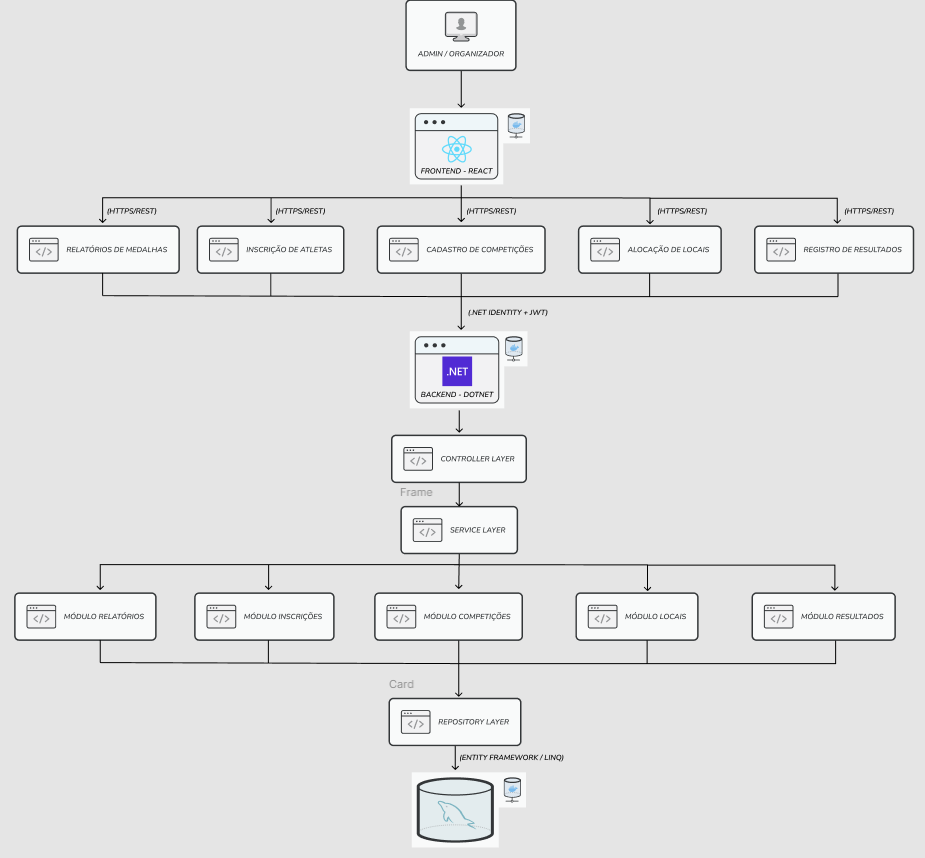

# 🏅 Sistema de Gestão das Olimpíadas (SGO)

## 📝 Descrição do Problema

Com a aproximação das Olimpíadas, torna-se necessário um sistema capaz de centralizar o gerenciamento das competições, inscrições de atletas, alocação de locais e controle de resultados. O **Sistema de Gestão das Olimpíadas (SGO)** tem como objetivo oferecer uma plataforma eficiente para que organizadores possam cadastrar competições, registrar resultados e gerar relatórios de desempenho por país.

O sistema foi projetado com uma arquitetura moderna baseada em camadas e APIs REST, permitindo uma integração fluida entre o frontend desenvolvido em React e o backend construído em .NET, com persistência de dados em MySQL e execução isolada via Docker.

## 👥 Integrantes da Dupla

- Integrante 1: *Luis Henrique Fantini Almeida*
- Integrante 2: *Rafael de Oliveira Caldeira Lopes*

## 📂 Estrutura do Repositório

```
SISTEMA-GESTAO-OLIMPIADAS/
├── imgs/
│ ├── CasosDeUso.drawio.png
│ ├── DiagramaDeClasses.drawio.png
│ ├── DiagramaDeComponentes.png
│ ├── DiagramaDeImplantação.png
│ └── DiagramaDePacotes.png
└── README.md
```

## 🧰 Tecnologias Utilizadas

### ⚛️ React
O **React** foi utilizado no desenvolvimento do *frontend* do sistema. Ele é responsável pela interface visual do organizador, permitindo a interação com as funcionalidades principais, como cadastro de competições, inscrição de atletas e consulta de relatórios. As requisições são feitas via **HTTP/REST** para o backend .NET.

### 🐋 Docker
O **Docker** é utilizado para a conteinerização das aplicações. Ele garante que o ambiente de execução seja padronizado e facilita a implantação tanto do backend quanto do banco de dados, permitindo a criação de ambientes isolados e reproduzíveis.

### 🟣 .NET (C#)
O **.NET** foi adotado no backend por sua robustez e suporte a APIs REST modernas. Ele é responsável por implementar as regras de negócio, autenticação via **.NET Identity + JWT**, e comunicação com o banco de dados através do **Entity Framework (ORM)**. Sua estrutura em camadas (Controller, Service e Repository) garante separação de responsabilidades e fácil manutenção.

### 🐬 MySQL
O **MySQL** foi escolhido como banco de dados relacional para armazenamento das informações de atletas, competições, resultados e países. Ele se integra ao backend por meio do **Entity Framework**, permitindo consultas e operações CRUD de forma eficiente e segura.

## 📊 Diagramas UML

### 1. Diagrama de Caso de Uso
Representa as principais interações entre os atores **Organizador, Admin, Atleta** e o sistema, incluindo o cadastro de competições, inscrição de atletas, alocação de locais e geração de relatórios.




### 2. Diagrama de Classes
Modela as principais entidades do sistema e seus relacionamentos, como **Atleta**, **Competição**, **Local**, **Resultado** e **País**, refletindo a estrutura lógica dos dados.




### 3. Diagrama de Pacotes
Organiza o sistema em pacotes para representar os agrupamentos lógicos de classes e responsabilidades, facilitando a modularização e manutenção do projeto.




### 4. Diagrama de Componentes
Mostra os principais componentes de software e como eles interagem entre si, evidenciando a comunicação entre o **Frontend React**, o **Backend .NET** e o **Banco de Dados MySQL**.




### 5. Diagrama de Implantação
Apresenta a arquitetura física do sistema, com os **nós de execução** representando o dispositivo do organizador, o **servidor de aplicação (.NET)** e o **servidor de banco de dados (MySQL)**. Também destaca os protocolos de comunicação entre cada camada.


📘 **Repositório:**  
[https://github.com/RafaelLopes1810/sistema-gestao-olimpiadas](https://github.com/RafaelLopes1810/sistema-gestao-olimpiadas)
